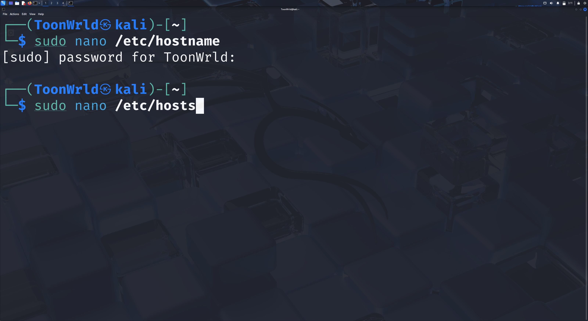

# 🐉 Kali Linux Post-Install Guide

This guide covers **essential steps after installing Kali Linux in VirtualBox**.  
You’ll learn how to:  

- Update & upgrade packages  
- Change passwords (including root)  
- Rename your default user  
- Update your hostname  
- Switch your default shell from Zsh to Bash  

---

## 📜 Table of Contents

- [🔄 Update & Upgrade Kali](#-update--upgrade-kali)  
- [🔑 Change Passwords](#-change-passwords)  
- [👤 Change Username](#-change-username)  
- [💻 Change Hostname](#-change-hostname)  
- [🐚 Change Default Shell](#-change-default-shell)  

---

## 🔄 Update & Upgrade Kali

1. Open terminal and run:  
   ```bash
   sudo apt update
   ```  
   

2. The system shows how many packages can be upgraded.  
   

3. Run:  
   ```bash
   sudo apt full-upgrade -y
   ```  
   

4. Packages begin downloading and upgrading.  
   

5. Reboot the system:  
   ```bash
   reboot
   ```  
   

---

## 🔑 Change Passwords

6. Open terminal and type:  
   ```bash
   passwd
   ```  
   

7. Enter current password → new password → confirm.  
   

8. Password updated successfully.  
   

9. Switch to root:  
   ```bash
   sudo su
   ```  
   

10. As root, set a password with:  
    ```bash
    passwd
    ```  
    

11. Root password set successfully.  
    

12. Log out → login screen, sign in as `root`.  
    

---

## 👤 Change Username

13. Run:  
    ```bash
    usermod -l ToonWrld -d /home/ToonWrld -m kali
    ```  
    

14. If you get “process currently in use,” kill the session:  
    ```bash
    kill -9 822  
    pkill -u kali  
    usermod -l ToonWrld -d /home/ToonWrld -m kali
    ```  
    

15. Update the group name:  
    ```bash
    groupmod -n ToonWrld kali
    ```  
    

16. Log out and log in with the new username.  
    

---

## 💻 Change Hostname

17. Edit the hostname file:  
    ```bash
    sudo nano /etc/hostname
    ```  
    

18. Change `kali` → `tutorials`.  
    - Save with **CTRL+O**, exit with **CTRL+X**.  
    

19. Edit the hosts file:  
    ```bash
    sudo nano /etc/hosts
    ```  
    

20. Replace `kali` → `tutorials`. Save & exit again.  
    

21. Reboot the system.  
    ```bash
    reboot
    ```  
    

22. Confirm hostname:  
    ```bash
    hostname
    ```  
    

---

## 🐚 Change Default Shell

23. Check current shell:  
    ```bash
    echo $SHELL
    ```  
    

24. Output should show `/usr/bin/zsh`.  
    

25. Change to bash:  
    ```bash
    chsh -s /bin/bash
    ```  
    

26. Reboot again.  
    

27. Confirm shell changed:  
    ```bash
    echo $SHELL
    ```  
    → Now shows `/bin/bash`.  
    

---

🎉 Done! Kali is updated, secured, renamed, and customized. Perfect baseline for pentesting labs.
